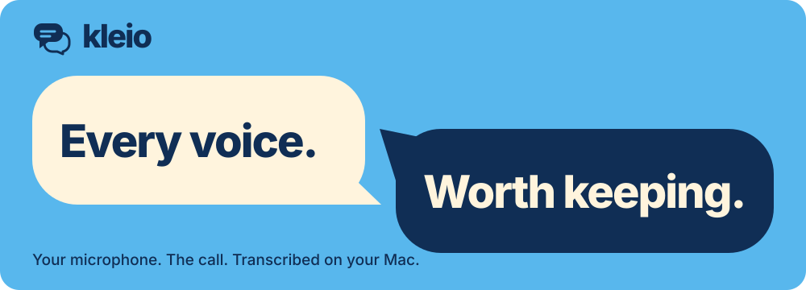

<p align="center">
  
</p>

<p align="center">
  <a href="https://kleio.talix.app">Website</a> ·
  <a href="#build-and-verify">Build from source</a> ·
  <a href="docs/user-guide.md">User guide</a> ·
  <a href="docs/development.md">Developer docs</a>
</p>

# Kleio

A native macOS meeting recorder that captures your microphone and the call on separate tracks, then transcribes them on your Mac. Search the transcript, correct a speaker's name, or jump back to the moment it was said.

Recording, transcription, and speaker detection run locally. Models need a one-time download. Summaries are optional, with local and cloud choices.

**Early access.** Build from source on an Apple silicon Mac running macOS 15 or later. Kleio currently produces development builds; release packaging and real-call validation are still in progress.

## Recording and review

| What you need | What Kleio does |
| --- | --- |
| Keep both sides of a call | Record a selected app and your microphone separately. Your microphone is always labelled as you. |
| Record the screen too | Choose a window or display with the macOS picker. Video, audio, notes, and transcript seeking share a timeline. |
| Put names to voices | Group remote speakers locally, rename or merge labels, and undo corrections without replacing transcript edits. |
| Find a moment again | Edit timestamped text, search and replace, seek through the waveform, and adjust playback speed. |
| Work with existing media | Import files, transcribe batches, use podcast participant tracks, or watch a folder for new recordings. |
| Take the result elsewhere | Export TXT, Markdown, HTML, SRT, VTT, CSV, JSON, or copy to the clipboard. |

Kleio also records microphone-only memos and has an explicit all-Mac-audio mode. It keeps working in the menu bar when you close the window.

Browser capture includes **all audible tabs** in the selected browser. A failed app target never switches to all-Mac audio. Call detection and **Follow meeting mute** need Accessibility access and still require live-call validation. [Recording details and limits →](docs/user-guide.md#record-a-meeting)

## Build and verify

You'll need Xcode with the Swift 6 toolchain and macOS 15 or later.

```sh
git clone https://github.com/dev-talix/kleio.git
cd kleio
swift package resolve
./scripts/make-app.sh
open build/Kleio.app
```

The packaging script builds the release executable, creates `build/Kleio.app`, and checks its signing, metadata, and resources. It uses the local development signing identity when available, or ad hoc signing otherwise. This is not a notarized release. [Releasing Kleio](docs/releasing.md) covers the signed, notarized build.

To run the automated tests:

```sh
swift test --disable-automatic-resolution
```

Installation options, version overrides, resource checks, and headless commands are in the [developer guide](docs/development.md).

## Your first recording

1. Open Settings → Models. Download and select a transcription model. Whisper supports vocabulary hints and translation to English; Parakeet's supported languages depend on the model.
2. In Settings → Audio Devices, choose your microphone and the output your call plays through. Set your microphone name in Settings → Speakers.
3. Add an app shortcut on Home for your meeting app or browser.
4. For a conversation with one other person, choose **One other person** to skip speaker detection. For multiple remote speakers, download a speaker model in Settings → Speakers.
5. Turn video on if needed, then click your app shortcut to start. Choose a window or display with the macOS picker when prompted, and grant the requested recording permissions.

Stop recording to review the transcript and speaker labels, add notes, and export. If a save fails, **Retry Save** uses the completed result still in memory. Finish pending saves before quitting. [Read the user guide →](docs/user-guide.md)

## Privacy and summaries

No meeting bot joins the call, and you don't need a Kleio account. Recordings, transcription, speaker grouping, and your library stay on your Mac.

Summaries are opt-in. Use Apple Intelligence on a supported Mac with macOS 26 or later, use Ollama locally, or configure a cloud provider in Settings → AI Summaries. Cloud summaries send transcript text, speaker names, notes, and recording context to the provider you choose. Claude, ChatGPT, and Cursor subscription summaries use their official command-line tools. API keys are stored in the macOS Keychain and excluded from library backups.

Review generated summaries against the transcript. Changes to transcript text, notes, or speaker names mark an existing summary out of date. [Models and summary settings →](docs/user-guide.md#summaries)

## Back up and restore

Use Settings → Library & Backup to create a `.kleiobackup` folder with recordings, transcripts, summaries, notes, saved people, voice profiles, and local preferences. Models and credentials are excluded.

Restore verifies the backup, applies it on the next launch, and preserves the previous library. Keep a copy on another drive. [Backup and restore steps →](docs/user-guide.md#back-up-and-restore)

## Documentation

| Guide | What's inside |
| --- | --- |
| [User guide](docs/user-guide.md) | Recording, speaker corrections, models, imports, exports, summaries, and backups. |
| [Developer guide](docs/development.md) | Build and installation options, storage layout, dependencies, and CLI commands. |
| [Validation checklist](docs/meeting-recorder-validation.md) | Automated evidence, native acceptance checks, and remaining release work. |
| [Recording flow](docs/flows/meeting-recording.md) | Capture lifecycle, timeline, recovery, and speaker-review implementation. |
| [Import and export flow](docs/flows/import-and-export.md) | Background imports, watch folders, export retries, and cloud settings. |
| [Call detection flow](docs/flows/call-detection.md) | Native detection, prompts, Accessibility limits, and verification gaps. |
